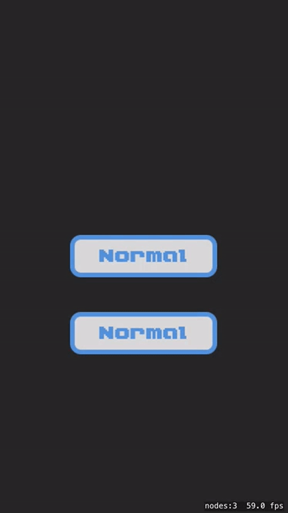

# Button-Sprite

A simple button class that can be used with SpriteKit. The button node supports images for it's Normal, Active, and 
Diabled states. 

Images can be any image you might use as a texture. The example uses these images: 

